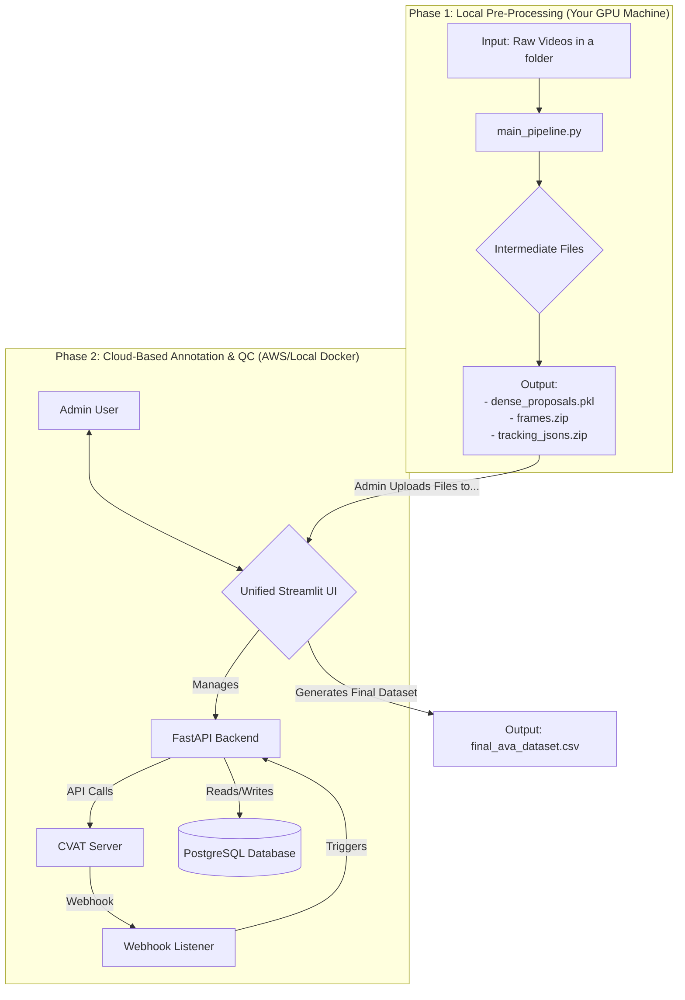

# AVA-Style Dataset Creation Pipeline

A unified pipeline for creating high-quality, multi-annotator spatio-temporal action localization datasets in AVA format.

## Project Status
✅ Prototype Complete

## Overview

This system implements a hybrid-cloud pipeline that combines powerful local computation for video pre-processing with scalable cloud-based annotation and quality control. Transform raw video files into model-ready training datasets through an automated workflow.

### Key Features
- **Hybrid Architecture**: Local GPU processing + cloud-based annotation
- **Multi-Annotator Support**: Collaborative annotation with quality control
- **AVA Format Output**: Industry-standard dataset format
- **Automated Tracking**: RF-DETR + KalmanSORT integration
- **Web-Based Interface**: Streamlit dashboard for management

## System Architecture



## Prerequisites

- Python 3.8+
- Docker and Docker Compose
- CUDA-capable GPU (for local processing)
- Git

## Installation & Setup

### 1. CVAT Setup (Critical Configuration Required)

Several prerequisites need to be done including adding a Docker override file and database schema.

#### Clone and Configure CVAT
```bash
# Clone the official CVAT repository
git clone https://github.com/cvat-ai/cvat
cd cvat
```

#### Create Docker Override File
**⚠️ IMPORTANT**: Create `docker-compose.override.yml` in the cvat/ directory:

```yaml
# docker-compose.override.yml
services:
  cvat_server:
    environment:
      SMOKESCREEN_OPTS: --unsafe-allow-private-ranges
  cvat_worker_webhooks:
    environment:
      SMOKESCREEN_OPTS: --unsafe-allow-private-ranges
```

#### Add Database Schema
You also need to add `cvat/initdb/schema.sql` with the following content. This way we're using the same database that CVAT is using:

```sql
CREATE TABLE IF NOT EXISTS projects (
    project_id INTEGER PRIMARY KEY,
    name VARCHAR(255) NOT NULL,
    created_at TIMESTAMP WITH TIME ZONE DEFAULT CURRENT_TIMESTAMP
);

CREATE TABLE IF NOT EXISTS tasks (
    task_id INTEGER PRIMARY KEY,
    project_id INTEGER REFERENCES projects(project_id),
    name VARCHAR(255) NOT NULL,
    status VARCHAR(50),
    assignee VARCHAR(255),
    retrieved_at TIMESTAMP WITH TIME ZONE,
    qc_status VARCHAR(50) DEFAULT 'pending'
);

CREATE TABLE IF NOT EXISTS annotations (
    annotation_id SERIAL PRIMARY KEY,
    task_id INTEGER REFERENCES tasks(task_id),
    job_id INTEGER NOT NULL,
    track_id INTEGER NOT NULL,
    frame INTEGER NOT NULL,
    xtl REAL,
    ytl REAL,
    xbr REAL,
    ybr REAL,
    outside BOOLEAN,
    attributes JSONB,
    annotator VARCHAR(255)
);
```

#### Start CVAT Containers
```bash
docker-compose up -d
```

#### Initialize CVAT

Now we need to create the superuser etc.

1. **Create Admin Account**:
   ```bash
   docker exec -it cvat_server /bin/bash
   
   # From inside the container's shell, run the following command 
   # and follow the prompts to set a username, email, and password
   python3 manage.py createsuperuser
   
   exit
   ```

2. **Setup Organization**:
   - Login to CVAT UI at http://localhost:8080
   - Create annotator accounts (e.g., annotator1, annotator2) from admin panel
   - Add annotator accounts as members via Django Admin panel at http://localhost:8080/admin

### 2. Python Environment Setup

```bash
# Create and activate virtual environment
python -m venv .venv
source .venv/bin/activate  # On Windows: .venv\Scripts\activate

# Install dependencies
pip install streamlit requests opencv-python tqdm psycopg2-binary pandas flask uvicorn python-multipart
```

## Usage

### Phase 1: Local Video Pre-Processing

#### 1. Prepare Input Videos

We need the MP4 videos to be in the exact format: `videos_files_name.zip/` containing `.mp4` files and place this in the uploads directory at `proposal_generation_pipeline`.

```bash
# Create uploads directory
mkdir proposal_generation_pipeline/uploads

# Place your raw videos in a ZIP file
# Example: proposal_generation_pipeline/uploads/raw_cctv_batch1.zip containing .mp4 files
```

#### 2. Run Pre-Processing Pipeline
```bash
python proposal_generation_pipeline/orchestrator.py --zip_file_name "(absolute path)raw_cctv_batch1.zip"
```

**Pipeline Components**:
- `rename_resize.py`: Video format standardization
- `clip_video.py`: 15-second segment creation
- `person_tracker.py`: RF-DETR + KalmanSORT tracking
- `create_proposals_from_tracks.py`: Proposal consolidation

**Outputs** (in `outputs/` directory):
- `dense_proposals.pkl`: Consolidated tracking data
- `frames.zip`: Extracted video frames
- `tracking_jsons.zip`: Individual tracking files

### Upload to Admin UI (Unified UI)

Start the services:

```bash
uvicorn metrics_logging.test:app --reload

streamlit run backup_files/ui.py
```

Now we create the XML files in the pre-proposals part. We upload the files `frames.zip` and `dense_proposals.pkl` and get the XMLs and frames.

In the task generator page, we assign the annotator names and the CVAT admin details and port, then click upload. This should take some time as seen in the terminal. The project should now show in the CVAT admin account and in the jobs section of the individual annotator accounts.

### Phase 2: Annotation & Quality Control

#### 1. Configure CVAT Webhook
1. Navigate to your CVAT project
2. Go to Actions → Setup Webhooks
3. Create webhook with:
   - **Target URL**: `http://host.docker.internal:5001/webhook`
   - **Events**: Check "Job updated"
   - **Active**: ✅ Enabled

#### 2. Start Services

**Terminal 1 - Webhook Listener**:
```bash
python processing_pipeline/webhook_listener.py
```

**Terminal 2 - Post-Annotation Processing**:
```bash
# Run post_annotation_service.py (select the correct project here) 
# each time to retrieve the completed work
python post_annotation_service.py
```

In the QC part of the admin UI, the completed tasks should now show and are pending for approval.

You can approve single tasks here or run the IAA and kappa scores for approval by admin, then click "Generate Dataset" to get the `AVA_dataset.csv`.

#### 3. Access the Dashboard
- Open browser to http://localhost:8501
- Upload the generated files (`dense_proposals.pkl`, `frames.zip`)
- Create and manage annotation projects
- Monitor annotation progress and quality control

## Project Structure(High level for this readme only)

```
ava-pipeline/
├── proposal_generation_pipeline/
│   ├── orchestrator.py         # Phase 1 orchestrator
│   ├── uploads/               # Input video files
│   └── outputs/              # Generated pipeline outputs
├── processing_pipeline/
│   └── webhook_listener.py    # CVAT webhook handler
├── backup_files/
│   └── ui.py                 # Streamlit dashboard
├── metrics_logging/
│   └── test.py              # FastAPI backend
├── post_annotation_service.py # Annotation retrieval
├── .venv/                    # Python virtual environment
└── README.md                # This file
```

## Output Format

The final dataset is generated as `AVA_dataset.csv` in AVA format:
- Spatio-temporal action localization data
- Multi-annotator consensus
- Quality control validation
- Model-ready training format

## Troubleshooting

### Common Issues

1. **CVAT Webhook Not Working**:
   - Verify `docker-compose.override.yml` is created correctly
   - Check webhook listener is running on port 5001
   - Ensure webhook URL uses `host.docker.internal`

2. **Database Connection Errors**:
   - Confirm PostgreSQL container is running
   - Verify database and tables are created
   - Check connection credentials

3. **GPU Memory Issues**:
   - Reduce batch size in tracking configuration
   - Monitor GPU memory usage during processing

### Support

For issues and contributions:
- Create an issue in the project repository
- Check logs in respective service terminals
- Verify all containers are running with `docker ps`

## License

[Specify your license here]

## Citation

If you use this pipeline in your research, please cite:
```bibtex
@software{ava_pipeline,
  title={AVA-Style Dataset Creation Pipeline},
  author={[Your Name/Organization]},
  year={2024},
  url={[Repository URL]}
}
```