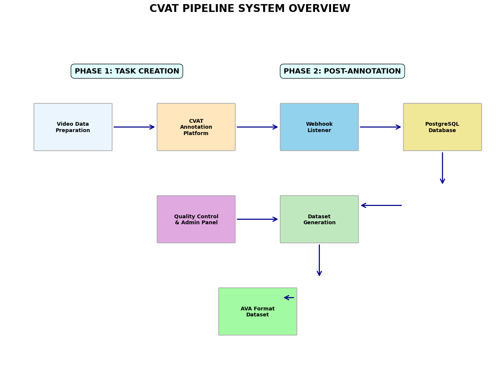

# Multi-Annotator CVAT Pipeline for AVA-Style Datasets

This project provides a complete, end-to-end prototype for creating high-quality, multi-annotator action recognition datasets in the AVA format. It features a Streamlit-based dashboard that automates the creation and assignment of annotation tasks in CVAT, a robust post-annotation service for data retrieval, and an admin panel for performing industry-standard quality control.

## Key Features

**Automated Task Creation**: A web UI to create CVAT projects and tasks from prepared video clips.

**Dynamic Assignment**: Randomly assigns clips to multiple annotators with a configurable overlap percentage for quality control.

**Pre-annotation Pipeline**: Converts dense proposals from object tracking models (e.g., YOLOX + DeepSORT) into CVAT-compatible pre-annotations with robust "ghosting" prevention.

**Event-Driven Post-Annotation**: Uses CVAT webhooks to automatically trigger the retrieval and storage of completed annotations.

**Persistent Storage**: Stores all retrieved annotations in a structured PostgreSQL database for auditing and analysis.

**Publication-Ready Quality Control**: An admin dashboard to calculate and review Inter-Annotator Agreement (IoU for boxes) and Cohen's Kappa (for action attributes).

**Final Dataset Generation**: A one-click process to apply consensus logic and generate a final train.csv file in the correct AVA format.

## System Architecture

The system is divided into two main phases: Task Creation and Post-Annotation. The entire workflow is designed to be managed from the web interfaces, with backend services handling the heavy lifting.

### System Overview

*Complete system architecture showing the interaction between all components*

### PHASE 1: TASK CREATION


*Task creation workflow from video preparation to CVAT task assignment*

The task creation phase involves:
1. **Video Processing**: Converting raw videos into clips and frames
2. **Object Detection**: Using YOLOX + DeepSORT to generate detection proposals
3. **Pre-annotation Generation**: Converting detections into CVAT-compatible XML format
4. **Task Assignment**: Using the Streamlit dashboard to create and assign annotation tasks

### PHASE 2: POST-ANNOTATION


*Post-annotation workflow from completion notification to final dataset generation*

The post-annotation phase includes:
1. **Completion Detection**: CVAT webhooks notify when annotation jobs are completed
2. **Data Retrieval**: Automated extraction and storage of completed annotations
3. **Quality Control**: Inter-annotator agreement analysis and validation
4. **Dataset Generation**: Final consensus-based dataset creation in AVA format

## Core Concepts & Nomenclature

### File Naming Conventions

The pipeline relies on a strict naming convention for automation:

- **Input Clip Folders**: `1_clip_000`, `1_clip_005`, etc.
- **Generated ZIPs (Frames Only)**: `1_clip_000.zip`, `1_clip_005.zip`
- **Generated XMLs (Annotations)**: `1_clip_000_annotations.xml`, `1_clip_005_annotations.xml`
- **CVAT Task Names**: `annotator1_1_clip_005`, `annotator2_1_clip_005`. This format is crucial as the system splits the name by the first `_` to identify the original clip name for overlap detection.

### Attribute Definitions & Action ID Mapping

To generate the final AVA-style CSV, the system converts multiple-choice attributes into a single, cumulative action_id. This logic is centralized in `services/shared_config.py`.

The system calculates a base_id for each attribute category and adds the index of the selected option. For example:

- `walking_behavior` starts at ID 1.
- `phone_usage` starts at `1 + len(walking_behavior_options)`.
- A final action_id of 8 would correspond to the action `talking_phone`.

### Ports & URLs

The complete system uses the following ports and URLs:

| Service | Port | URL | Purpose |
|---------|------|-----|---------|
| CVAT | 8080 | http://localhost:8080 | Main annotation interface. |
| PostgreSQL Database | 5432 | localhost:5432 or 127.0.0.1:5432 | Stores retrieved annotations. |
| Webhook Listener | 5001 | http://host.docker.internal:5001/webhook | Receives notifications from CVAT. |
| Streamlit Task Creation App | 8501 | http://localhost:8501 | UI for creating projects and assigning tasks. |
| Streamlit Admin QC App | 8502 | http://localhost:8502 | UI for quality control and dataset generation. |

## Setup and Installation

### 1. Prerequisites

- Python 3.9+
- Docker and Docker Compose

### 2. CVAT Setup (Crucial Steps)

**A. Clone the CVAT Repository:**

```bash
git clone https://github.com/cvat-ai/cvat
cd cvat
```

**B. Create the Docker Override File:**

This step is critical for allowing the CVAT webhooks to communicate with your local machine. In the `cvat/` directory, create a new file named `docker-compose.override.yml` and add the following content:

```yaml
# docker-compose.override.yml
services:
  cvat_server:
    environment:
      SMOKESCREEN_OPTS: --unsafe-allow-private-ranges
  cvat_worker_webhooks:
    environment:
      SMOKESCREEN_OPTS: --unsafe-allow-private-ranges
```

**C. Start the CVAT Containers:**

```bash
docker-compose up -d
```

**D. Create Admin and Annotator Accounts:**

```bash
docker exec -it cvat_server /bin/bash -ic 'python3 manage.py createsuperuser'
```

Use the CVAT UI to create your annotator accounts and add them to an organization.

### 3. Database Setup

**A. Start the Database Container:**

```bash
docker run --name cvat-db -e POSTGRES_PASSWORD=mysecretpassword -p 5432:5432 -v cvat_postgres_data:/var/lib/postgresql/data -d postgres
```

**B. Create the Database and Tables:**

```bash
# Create the database
docker exec -it cvat-db psql -U postgres -c "CREATE DATABASE cvat_annotations;"

# Create the tables
docker exec -it cvat-db psql -U postgres -d cvat_annotations -c "
CREATE TABLE IF NOT EXISTS projects (...);
CREATE TABLE IF NOT EXISTS tasks (...);
CREATE TABLE IF NOT EXISTS annotations (...);
"
```

(Full schema is in `initdb/schema.sql`)

### 4. Application Setup

```bash
# Create and activate a virtual environment
python -m venv .venv
source .venv/bin/activate  # On Windows: .venv\Scripts\activate

# Install the required Python packages
pip install streamlit requests opencv-python tqdm psycopg2-binary pandas flask
```

## End-to-End Usage Guide

1. **Prepare Pre-annotations**: Generate the ZIP (frames only) and XML files.

```bash
python tools/proposals_to_cvat.py \
  --pickle_path "data/proposals/dense_proposals.pkl" \
  --frame_dir "data/frames/" \
  --output_zip_dir "data/uploads/" \
  --output_xml_dir "data/cvat_xmls/"
```

2. **Start Services**:
   - **Webhook Listener**: `python webhook_listener.py`
   - **Task Dashboard**: `streamlit run app.py`
   - **Admin Dashboard**: `streamlit run admin_app.py`

3. **Create & Assign Tasks**: Use the Task Creation Dashboard (`app.py`) to upload your generated ZIP and XML files, define project parameters, and assign tasks to annotators.

4. **Annotation**: Annotators log in to CVAT and complete their assigned jobs. When a job is marked "completed", the webhook automatically triggers the next step.

5. **Retrieve Data**: The `post_annotation_service.py` is triggered by the webhook and automatically retrieves the completed annotations, storing them in the PostgreSQL database.

6. **Quality Control**: Use the Admin Dashboard (`admin_app.py`) to connect to the database, review completed tasks, and run quality checks on overlap tasks. Approve or reject work based on the IAA (IoU) and Kappa scores.

7. **Generate Final Dataset**: Once you have a set of approved annotations, use the "Generate Final Dataset" button in the admin dashboard. This will create your final `train.csv` file and provide a download link.